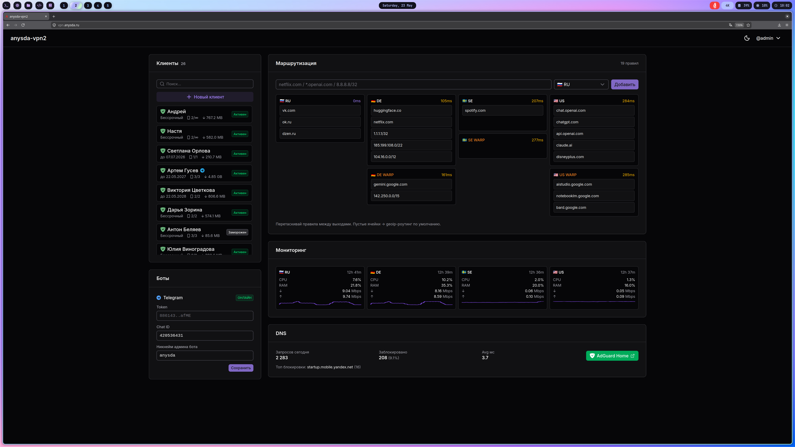
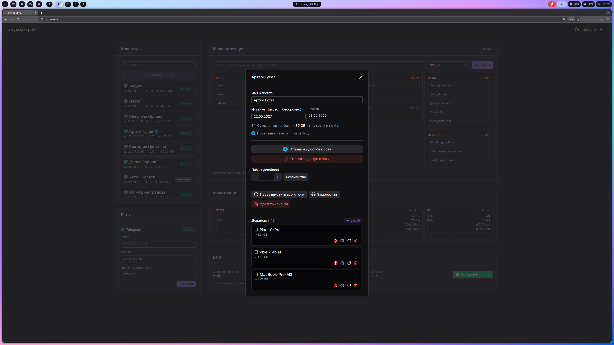

# anysda-vpn2

Веб-панель для управления многонодным VPN-стеком (WireGuard + OpenVPN)
с авто-geoip-роутингом, ручными правилами (drag-and-drop), мониторингом
и Telegram-ботом для админа и для конечных клиентов.



Слева — список клиентов с трафиком и статусами; центр — Маршрутизация
(drag-and-drop правил по колонкам outbound'ов RU/DE/SE/US, авто-роутинг
+ ручные правила); справа в столбце «US» — AI-сервисы, в «DE» — стриминг.
Снизу — Мониторинг нод (CPU/RAM/Mbps) и AdGuard DNS со статистикой
запросов и блокировок. Слева снизу — настройки Telegram-бота.



Карточка клиента: имя, срок, суммарный трафик, привязка к Telegram-боту,
лимит устройств, заморозка/перевыпуск/удаление. Снизу — список устройств
с per-device трафиком и кнопками (скачать WG `.conf`/QR, OVPN `.ovpn`,
перевыпустить ключи, удалить устройство).

## Что внутри

- **Веб-панель (Nuxt 4):** клиенты, устройства, маршрутизация, графики,
  AdGuard, Telegram-настройки. Один admin, опционально TOTP.
- **Двухуровневая модель:** клиент (человек) → его устройства. У каждого
  устройства свои WG-ключи и OpenVPN-сертификат.
- **Авто-роутинг (sing-box):** RU-трафик через WAN entry, заграница
  через Hysteria2 на лучший exit; быстрый failover (~5–7с).
- **Ручные правила:** домен/IP → конкретный outbound, drag-and-drop в
  UI; sing-box подхватывает без рестарта клиентов.
- **AdGuard Home:** DNS + блок-лист для VPN-клиентов с включённой
  фильтрацией.
- **Telegram-бот:** админ управляет клиентами командами `/clients`,
  получает алерты; конечные клиенты сами получают конфиги, добавляют
  устройства и видят уведомления об изменениях.
- **Мониторинг:** карточки нод (CPU/RAM/RX/TX), RTT по выходам, графики;
  `node_exporter` → VictoriaMetrics + clash-api sing-box.
- **Деплой одной командой:** `./setup.sh` → `./deploy.sh`. 12 стадий,
  идемпотентно, без ручных шагов на нодах.

## Стек

Nuxt 4 (Vue 3, TS strict) · Nuxt UI 3 (Tailwind v4) · Nitro · Drizzle
ORM + libSQL (SQLite) · nuxt-auth-utils (cookie-сессии + Argon2id) ·
свой TOTP (RFC 6238) · sing-box (Hysteria2) · WireGuard (kernel) +
OpenVPN · AdGuard Home · VictoriaMetrics + node_exporter · Caddy
(reverse-proxy + Let's Encrypt) · Python (`python-telegram-bot`) для
бота. Образы — `node:22-slim` (панель), `python:3.13-slim` (бот).

## Архитектура

```
WireGuard client  ·  OpenVPN client
   │ wg0 udp/51820        tun0 udp/1194
   ▼
[entry-нода]
 ├─ WireGuard (wg0) + OpenVPN (tun0)
 │   iptables PREROUTING -i wg0/tun0 → TPROXY → sing-box :7898
 ├─ sing-box роутер
 │   geoip:ru / .ru/.рф → direct-ru (WAN entry)
 │   остальное → foreign-best (hy2-* exit'ы; выбирает failover-watchdog)
 │   ручные правила → /etc/anysda/manual-routes.json
 ├─ anysda-vpn2 panel  (Caddy → :51821)
 ├─ AdGuard Home + Caddy
 ├─ VictoriaMetrics (scraping mgmt-mesh 10.99.0.0/24)
 └─ Telegram-бот (контейнер) — егрессит в Telegram через exit
       hy2-{tag}-direct → exit-нода → internet
```

## Структура

```
vpn2/
├── app/                      # Nuxt 4 панель
├── infra/                    # bash + python оркестратор деплоя
│   ├── deploy.sh             # главный pipeline
│   ├── lib/                  # config2env, gen-router-config, failover-watchdog, ssh
│   ├── configs/              # шаблоны конфигов (envsubst)
│   └── scripts/              # стадии 00 / 05 / 10 / 20 / 21 / 22 / 25 / 28 / 29 / 30 / 35 / 99
├── telegram/                 # Python бот (опциональный)
├── deploy.sh                 # entry-point, делегирует infra/deploy.sh
├── setup.sh                  # интерактивный мастер config.yaml
└── config.example.yaml       # шаблон конфигурации
```

---

## Quickstart — развернуть с нуля

Нужны: 1 entry-нода в России (4 ГБ RAM, 20 ГБ диск) и
N exit-нод (минимум 1, рекомендую 2–3 для failover; 1 ГБ RAM, 5 ГБ
диск). Все — **Ubuntu 24.04 LTS, чистая установка**, root по SSH-паролю.
Разворачивается с entry-ноды — она же оркестратор.

### 1. Подключиться к entry-ноде

```bash
ssh root@<entry-ip>
```

> *(Опционально, до подключения)* `ssh-copy-id root@<entry-ip>` — кладёт
> твой публичный ключ на entry. Деплой подхватит его и при бутстрапе
> раскатает на все exit-ноды — после этого по всему стенду ходишь по
> ключу. Без этого шага деплой тоже работает: оркестратор сам сгенерит
> ключ на entry и распространит уже свой.

### 2. Склонировать репозиторий 

```bash
git clone https://gitlab.anysda.space/anysda/vpn2 /opt/anysda-vpn2
cd /opt/anysda-vpn2
```

### 3. Заполнить конфиг мастером

```bash
./setup.sh
```

Записывает ответы в `config.yaml`

### 4. Запустить деплой

```bash
./deploy.sh
```

Сам поставит локальные зависимости, проверит SSH ко всем нодам,
развернёт mgmt-mesh, поднимет Hysteria2 на exit'ах, WG + OVPN +
sing-box-роутер + failover-watchdog + AdGuard + VictoriaMetrics +
панель + бота на entry. Идемпотентно — можно перезапускать.

### 5. Создать первого клиента

В панели: «➕ Новый клиент» → имя → «Создать» → откроется карточка
клиента → «➕ Добавить устройство» → имя → «Создать». Дальше — кнопки
«Скачать WG / .conf / QR» или «Скачать OVPN».

---

## Перезапуск отдельных стадий

С entry-ноды:

```bash
./deploy.sh 30-frontend ru       # пересобрать панель
./deploy.sh 35-telegram ru       # перезапустить бота
./deploy.sh 10-foreign foreign   # все exit-ноды
./deploy.sh 99-verify all        # smoke-тест
```


---

## Как пользоваться админским ботом

Бот опционален; включается, если в `setup.sh` (или в разделе «Боты»
веб-панели) заданы `bot_token` и `chat_id`. Админский чат — тот, чей
`chat_id` указан (своя личка с ботом или приватная группа с
выключенным Group Privacy у `@BotFather`).

### Команды

| Команда | Что делает |
|---|---|
| `/clients` | управление клиентами (список + создание + действия) |
| `/status` | статус нод (CPU/RAM/трафик) и outbound'ов (RTT) |
| `/nodes` | список exit-нод с RTT |
| `/start`, `/help` | админское приветствие |

### `/clients` — управление клиентами

Бот пришлёт список — каждый клиент это кнопка вида
`✅ Иван Иванов — 3/3 девайс.` (`✅` активен, `❄️` заморожен; `3/3` —
устройств/лимит). Внизу — кнопка `➕ Создать клиента`.

Тапни клиента → откроется карточка с кнопками:

| Кнопка | Действие |
|---|---|
| `❄️ Заморозить` / `☀️ Разморозить` | приостановить/вернуть доступ |
| `➖ Лимит` / `➕ Лимит` | изменить лимит устройств на ±1 |
| `🗓 Срок` | задать дату окончания (`ДД.ММ.ГГГГ` или `бессрочно`) |
| `📨 Отправить приглашение` | бот пришлёт готовое сообщение-инвайт для пересылки клиенту |
| `🗑 Удалить` | удалить клиента (со спросом подтверждения) |
| `‹ К списку` | назад |

Создать: `➕ Создать клиента` → бот спросит имя → клиент создан, сразу
открыта его карточка (фильтрация трафика включается по умолчанию).

### Конечный клиент в боте

Когда админ нажмёт «📨 Отправить приглашение» — бот пришлёт в админский
чат **готовый текст с ссылкой**
`t.me/<bot>?start=<password>` для пересылки клиенту. Клиент жмёт
ссылку, бот привязывает его чат, открывает меню устройств — дальше он
сам качает WG/OVPN-конфиги, добавляет устройства и видит уведомления
(смена имени, лимита, срока, заморозка, удаление профиля).

«Отозвать доступ к боту» в карточке клиента в панели — отвязывает
Telegram **и перевыпускает пароль клиента**: старая инвайт-ссылка
становится недействительной.

### Чего бот не делает (это только в веб-панели)

- Перевыпуск ключей устройств/клиента.
- Манипуляции с маршрутизацией.
- Управление настройками бота (токен, chat_id, admin_username).

